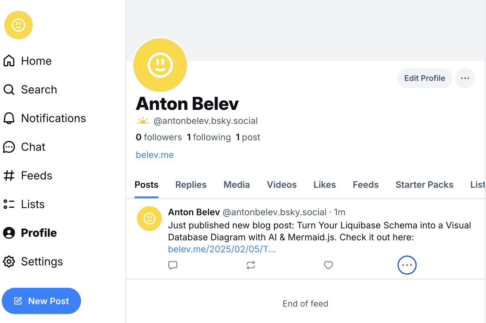

# hexo-bluesky-feed

A Hexo plugin that automatically publishes your newest blog post to Bluesky whenever you generate your site with the `--bluesky` flag—giving you full control over when updates get posted.

## Example

Here is what `hexo-bluesky-feed` looks like in practise:



## Installation

Install the package via npm in your Hexo site directory:

```bash
npm install hexo-bluesky-feed --save
```

## Configuration

### Hexo Configuration

In your Hexo site's `_config.yml`, you can add a blueskyFeed section for your Bluesky-related

```yml
blueskyFeed:
  # The website URL used for constructing post links on Bluesky.
  url: "https://yourwebsite.com/"
  # The default message for Bluesky posts.
  # Use placeholders {title} and {url} for dynamic replacement.
  message: "Just published new blog post: {title}. Check it out here: {url}"
```

## Obtaining Your BLUESKY_APP_PASSWORD

To allow the plugin to post updates to your Bluesky account, you only need to provide your Bluesky handle and an app password. Our script uses these credentials to automatically obtain a fresh access token and your DID each time you deploy your Hexo site.

1. Create a Bluesky Account and Find Your Handle
   
- Sign Up:
If you haven’t already, sign up for a Bluesky account at [https://bsky.app](https://bsky.app). 

- Locate Your Handle:
Your handle is your unique identifier on Bluesky, typically in the format `username.bsky.social`. You can find it on your profile page or in your account settings.

2. Generate an App Password

- Navigate to App Passwords:
After logging in, go to your account settings and locate the “App Passwords” section.
- Create a New App Password:
Click the “Add App Password” button (or similar), give it a descriptive name (e.g., “Hexo Plugin”), and generate a new app password.

**Important**: Copy and securely store this app password, as it will be used by the plugin. This value will be set as your `BLUESKY_APP_PASSWORD`.

3. Configure Your Environment Variables
   
In your Hexo project's root directory, create a `.env` file (and add it to your `.gitignore` to prevent accidental commits) with the following content:

```bash
BLUESKY_HANDLE=<your-username.bsky.social>
BLUESKY_APP_PASSWORD=<your_app_password>
```

**Important**: Do not store your app password or tokens in your public repository. Always add your `.env` file to your `.gitignore`.

The plugin will use these environment variables to automatically obtain a fresh access token and your `DID`. You do not need to manually obtain or store a `BLUESKY_ACCESS_TOKEN`.

## Usage
After configuring your credentials and updating your `_config.yml`, simply run:

```bash
hexo generate --bluesky
```

or 

```bash
hexo g --bluesky
```

If you run `hexo generate` without `--bluesky`, the plugin will skip posting.

Then (if needed) deploy your site via `hexo deploy`. By default, `hexo deploy `may generate your site if you have a valid deploy config—but it typically will not forward the `--bluesky` flag. If you need to post to Bluesky as part of deploy, ensure you pass the flag or generate with `--bluesky` before deploying.

## Development

Follow these steps to publish a new version of `hexo-bluesky-feed` to `npm`:

```bash
npm login
npm whoami
npm version patch
git add .
git commit -m "Bump version to x.y.z"
git push && git push --tags
npm publish
```

## License
This project is licensed under the MIT License. See the LICENSE file for details.
